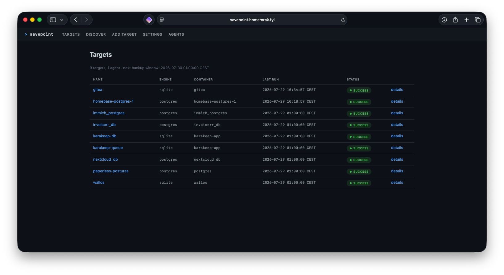
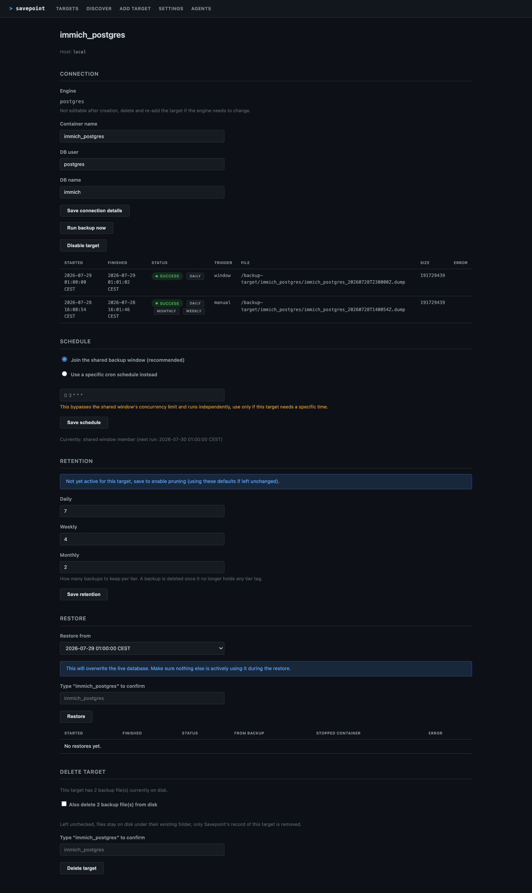
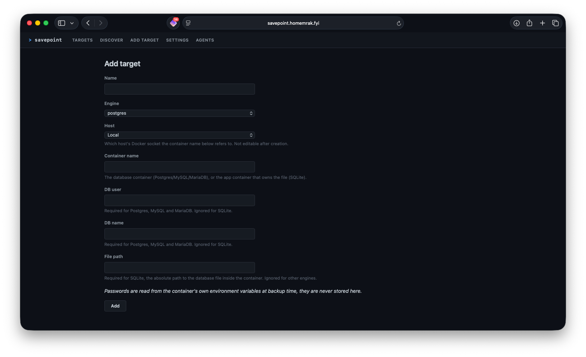
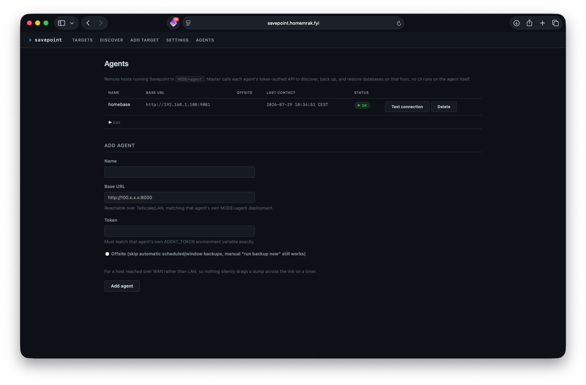
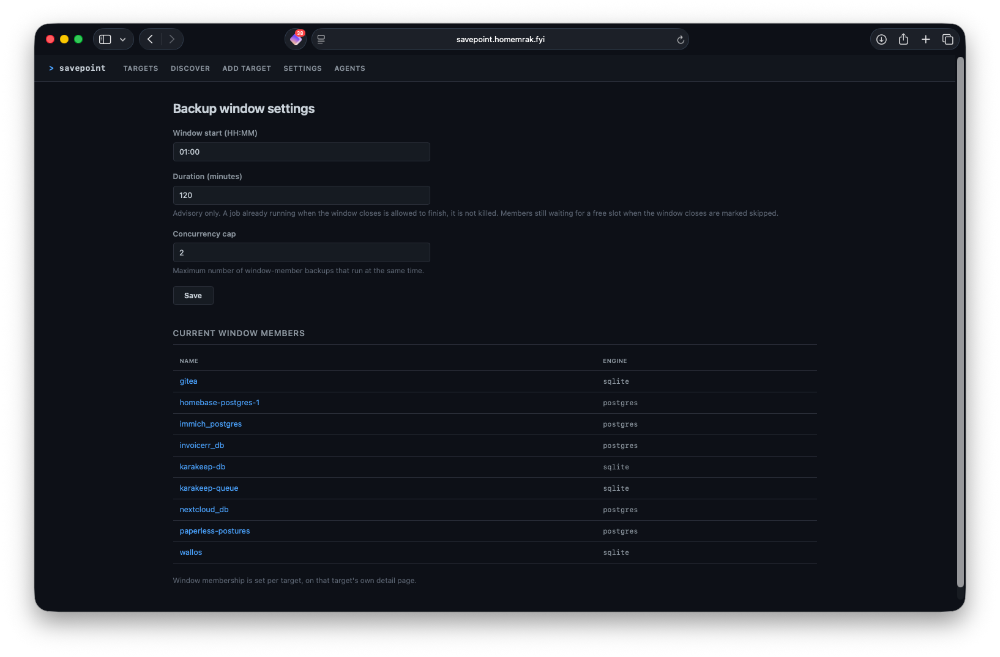

# Savepoint

Savepoint is a self-hosted database backup manager for a homelab. It discovers database containers on a Docker host, schedules and runs backups (per-database or in a shared backup window), keeps a rolling GFS-style (daily/weekly/monthly) history, supports restoring a chosen backup, and can pull backups in from other hosts on the network through a lightweight agent.

> [!WARNING]
> **This app requires access to the Docker socket (`/var/run/docker.sock`), mounted read-write.** That is equivalent to root on the host it runs on: anything with access to Savepoint's container effectively has access to every other container, volume, and the host itself. Treat it accordingly:
> - Never expose Savepoint's port to the public internet. It has no built-in login (see the Auth section below), and even with forward-auth in front of it, the underlying blast radius of anyone reaching it is total.
> - Deploy it only on a trusted LAN or over Tailscale/VPN, the same trust model as tools like Dozzle or Dockhand.
> - Anyone who can reach Savepoint's port can, at minimum, read every configured database's connection details and trigger a backup or restore against it.

> [!WARNING]
> **Traffic between an agent (`MODE=agent`) and master is plain, unencrypted HTTP by default.** There is no TLS built in. This is fine on a Tailscale network (already encrypted at the WireGuard layer) or a trusted LAN, but an agent should never be reachable over an untrusted or public network. The bearer token used between master and an agent is defense-in-depth on top of the network boundary, not a substitute for it.

## What it does

- Connects to the Docker socket and detects database containers automatically (Postgres, MySQL, MariaDB) by image name, reading their env vars to pre-fill connection details.
- Also supports pointing manually at a database: a container discovery couldn't identify, or a SQLite file living inside an app container.
- Runs backups on a schedule, either per-database (cron) or inside a shared "backup window" (start time, duration, concurrency cap) so multiple jobs don't hit the storage target at once.
- Keeps a rolling (GFS-style) history: daily, weekly, monthly copies, with independent, configurable retention counts per tier per database.
- Supports restoring a chosen backup from its history, with an explicit type-to-confirm step before anything destructive happens.
- Runs as a single Docker image with two modes:
  - `MODE=master`: the UI, the scheduler, the state database, GFS retention, and the agent registry all live here. This is the only mode with a web UI.
  - `MODE=agent`: a headless remote executor for a database host on another machine. No UI, no state of its own, it only exposes a small token-authed API that master calls to discover, back up, and restore databases on that host. Master pulls the resulting files in and manages retention centrally.
- Sends notifications via [ntfy](https://ntfy.sh) on backup/restore failure and success, and a summary after each scheduled window completes.
- Optional forward-auth support (off by default): if `FORWARD_AUTH_HEADER` is set, Savepoint requires that header on every request, trusting whatever identity a reverse proxy (Authentik, Traefik forward-auth, etc.) already put there. Savepoint has no login of its own, presence-only header checking is not a substitute for keeping the port off any network the proxy doesn't sit in front of.

## How it works

- **Discovery**: lists containers via the Docker socket, matches image names against known keywords for Postgres/MySQL/MariaDB, and reads env vars for connection defaults. Nothing is ever added automatically, every discovered candidate needs a one-click confirmation. SQLite databases can't be autodetected the same way, they're added manually by pointing at a container + file path.
- **Adapters**: one implementation per engine behind a common interface (`discover`, `default_connection_info`, `backup`, `restore`). Postgres uses `pg_dump`/`pg_restore`, MySQL/MariaDB use `mysqldump`/`mysql` (and their `mariadb-*` equivalents where the image requires it), SQLite uses either the `sqlite3` `.backup` command for a live-consistent copy or a raw file copy as a fallback, visibly flagged as such in the UI.
- **Scheduling**: APScheduler running in-process. Each database is either on its own cron schedule or a member of the shared window; the window respects a configurable concurrency cap so backups don't all hit the storage target simultaneously.
- **Retention**: on every successful backup, it's tagged `daily` (always), `weekly` (if it's the first success of the ISO week), and `monthly` (if it's the first success of the calendar month). A prune sweep keeps the configured number of backups per tier and only deletes a file once it holds no tags at all.
- **Restore**: pick a target, pick a backup from its history, type the target's name to confirm, and Savepoint runs the adapter's restore against the same connection the backup came from. Where stopping the target's container first is safe and meaningful (SQLite), it's offered as an option; where the database server has to stay up for the restore tool to even connect (Postgres/MySQL/MariaDB), the UI warns clearly instead.
- **Remote agent**: an agent-owned target behaves identically to a local one everywhere in the UI, scheduling, and retention, the only difference is that its `backup()`/`restore()` calls happen over HTTP to the agent's token-authed API instead of a local `docker exec`. An agent can be flagged `offsite` to exclude it from automatic scheduled/window backups (manual runs still work), so nothing silently drags a large dump across a slow WAN link on a timer.

See `Docs/03-Proposed-Architecture.md` for the full design writeup, including the parts of the original design that changed during the build (the remote agent especially, see below).

## Screenshots

**Targets** — the dashboard: every tracked database, engine, last run status, and a summary strip (target/agent counts, next backup window, anything currently failing).

**Target detail** — connection details, run history, schedule (with next-run time), retention tiers, and restore, all on one page.

**Add target** — manual add, with a Host selector for a local container vs. one on a registered agent.

**Agents** — the remote agent registry: health status, last contact, edit-in-place, and offsite flagging.

**Settings** — the shared backup window: start time, duration, concurrency cap, and current members.

## What this has been tested on

Every phase of this build included a real-world verification pass against actual Docker containers on a throwaway test host, not just mocked unit tests, documented phase-by-phase in `Docs/progress/`:

- **Postgres, MySQL, MariaDB, SQLite**: real backup and restore exercised against all four engines.
- **MariaDB specifically**: recent official MariaDB images (10.6+, confirmed against `mariadb:11`) ship `mariadb-dump`/`mariadb` instead of the `mysqldump`/`mysql` compatibility symlinks. Savepoint accounts for this per-adapter, both for backup and restore.
- **SQLite**: both the live `.backup`-command path and the raw-file-copy fallback (for containers without `sqlite3` installed) were exercised and confirmed visibly distinguishable in the UI.
- **Scheduling**: real per-database cron and the shared backup window, including concurrency capping and window-deadline cutoff behavior, run unattended.
- **Retention**: real GFS tagging and pruning across daily/weekly/monthly tiers.
- **Restore**: real restores across all four engines, including the SQLite stop-container option and the Postgres/MySQL/MariaDB "server must stay running" path.
- **Remote agent**: a genuine second host running `MODE=agent` (a separate throwaway LXC), covering discovery, manual backup/restore, scheduled/window backups against a remote target, the `offsite` scheduling exclusion, token rotation, and a forced hard-crash mid-transfer.
- **ntfy notifications**: real delivery against a homelab ntfy instance, including bearer-token auth.

No specific version matrix beyond what's noted above (e.g. exact Postgres/MySQL minor versions) is tracked in this repo. Check `Docs/progress/` for the specific images and findings from each phase's verification pass if that level of detail matters for your setup.

## What this has not been tested on

- **A genuinely slow or unreliable WAN link for an offsite agent.** The `offsite` flag exists and correctly excludes a target from automatic scheduling, but no real cottage-node-style offsite host has been built yet to test actual transfer behavior over a slow connection, that scenario is currently a design accommodation, not a verified one.
- **A real forward-auth proxy deployment.** `FORWARD_AUTH_HEADER` and its middleware are tested in isolation; putting a real Authentik or Traefik forward-auth instance in front of Savepoint and confirming header behavior end to end has not happened yet at the time of writing.
- **Non-Docker deployment.** This assumes a Linux Docker host with a mountable `docker.sock`; it has not been run any other way.
- **CPU architecture beyond whatever the test host used.** No explicit ARM vs. x86 verification was done.
- **Concurrent multi-operator use.** This is built and tested as a single-operator tool, per the original requirements; nothing has been verified about simultaneous use by more than one person.
- **Continuous integration.** There is a test suite (`pytest tests/`), but no CI pipeline runs it automatically on this repo.

## Getting started

1. Copy `.env.sample` to `.env` and fill in what you need (ntfy, and `AGENT_TOKEN`/`FORWARD_AUTH_HEADER` if applicable).
2. For a master deployment: `docker compose up -d` using `docker-compose.yml`. Adjust the bind-mounted backup target path and the `TZ` value for your setup.
3. For an agent deployment on another host: use `docker-compose.agent.yml` as a separate stack on that host, **read the warning at the top of that file first**, generate a token, and register the agent from master's `/agents` page using the same token.
4. Open Savepoint's web UI (master only, port 8000 by default), use `/discover` or `/targets/add` to start tracking databases.

## Documentation

- `Docs/01-High-Level-Description.md` through `Docs/04-Initial-Build-Plan.md`: the original pitch, requirements, and architecture.
- `Docs/03-Proposed-Architecture.md`: kept up to date as the design evolved during the build (most notably, the remote agent's design changed significantly during Phase 6).
- `Docs/progress/`: one plan doc and one build summary per phase, each plan doc closing with a "Real-world verification results" section. This is the most complete record of what was actually built, tested, and found along the way.

---

**Built with [Claude Code](https://claude.com/claude-code).** This project followed a strict phased process: a plan was written and reviewed before any code for that phase was written, then built, then verified against real Docker containers, with every step recorded. See `Docs/progress/` for the full history of that process, phase by phase, if you want to review how this was actually built.
